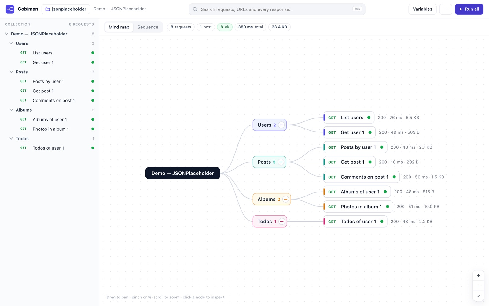
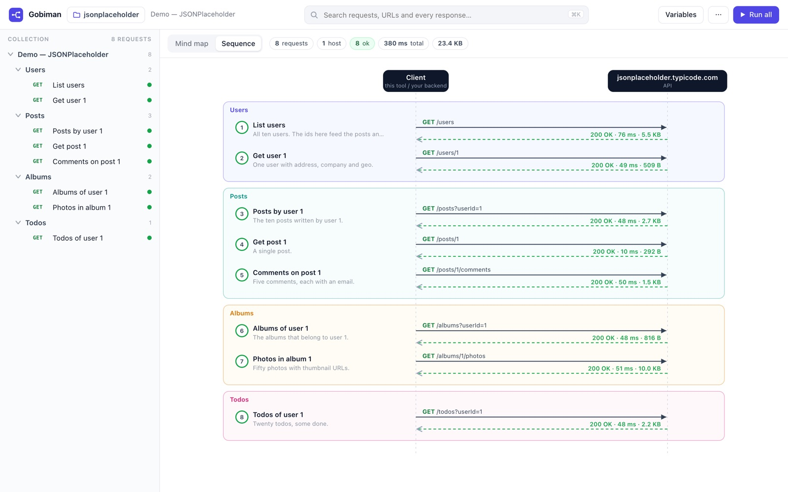
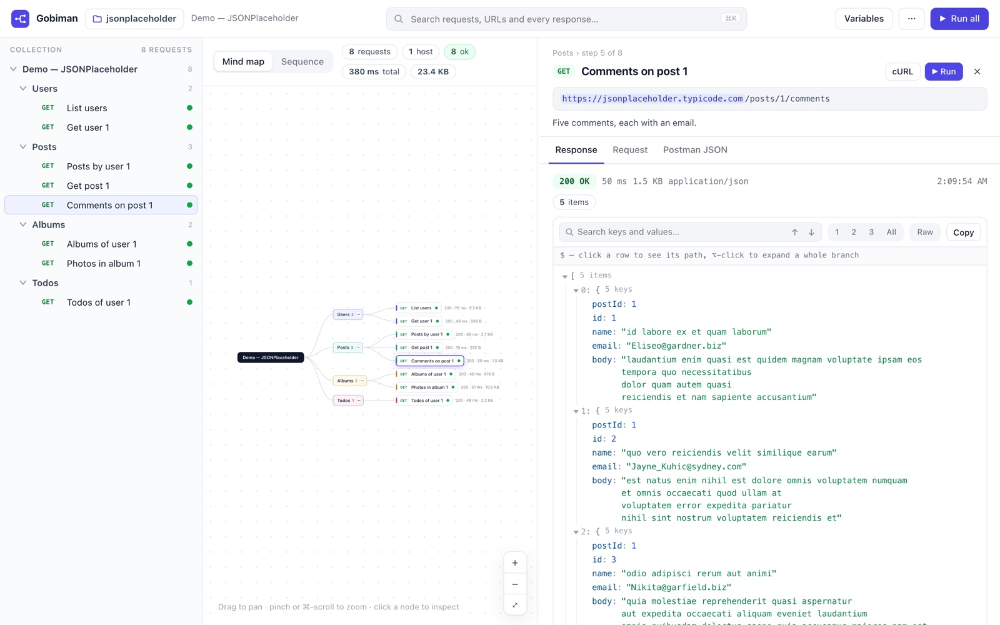

# Gobiman

**Gobiman is a zero-dependency local web app that turns any Postman collection into an interactive mind map and sequence diagram, runs the requests, and lets you explore every response in a searchable, collapsible JSON viewer.**







## Run it

```bash
git clone <this repo>
cd gobiman
node server.js            # → open http://localhost:4600
```

Needs Node 18 or newer. No `npm install`, no build step. (On macOS you can also double-click `start.command`.)

## Add your collections

Every folder inside `gobiman/collections/` is a **workspace**:

```
gobiman/collections/
├── demo-petstore/                            ← workspace (public API, works without a token)
│   └── petstore.postman_collection.json
├── demo-jsonplaceholder/                     ← workspace (public API, 8 read-only requests in 4 folders)
│   └── jsonplaceholder.postman_collection.json
└── my-api/                                   ← add your own
    ├── something.postman_collection.json
    └── something.postman_environment.json
```

1. Create a folder, copy your `*.postman_collection.json` (and optional `*.postman_environment.json`) files into it.
2. Start the server (or click **Reload** on the workspace screen if it is already running).
3. Pick the workspace on the start screen. The folder icon in the top bar switches workspaces.

To read collections from somewhere else: `node server.js /path/to/folder`.

## Tokens and variables

Click **Variables** and paste any secret (e.g. a bearer token). Values live in the server's memory only — never written to disk, gone when the server stops. To pre-fill one at start:

```bash
GOBIMAN_VAR_apiToken=eyJ... node server.js
```

## What you get

| Area | What it does |
|---|---|
| **Mind map** | Collection → folders → requests as a collapsible tree. Pan (drag / scroll), zoom (pinch / ⌘-scroll / buttons), fit. Status dot, status code, time and size on each node after a run. |
| **Data links** | Dashed magenta arrows: an ID hard-coded in a request URL that first appeared in an earlier response. Computed automatically after running — shows you which call feeds which. |
| **Sequence** | Client ↔ API sequence diagram in call order, grouped by folder, with request path and response status on every arrow. |
| **Inspector** | Resolved URL with variables highlighted, description, connections, tabs for Response / Request (headers, body, scripts) / raw Postman JSON. Copy as cURL. |
| **JSON viewer** | Collapsible tree with inline previews, search with match count and ↑/↓ navigation (auto-expands to hits), depth 1/2/3/all, raw view, copy value / copy JSONPath, ⌥-click expands a whole branch, "→ request" chips on IDs that other requests use. PDF and image responses render inline. |
| **Global search (⌘K)** | Searches request names, URLs, descriptions **and the full text of every response**; jumps straight to the match inside the JSON. |
| **Run** | Run one request, a folder, or everything in order. Requests that change data (PUT/POST/…) always ask first. Stop button while running. |
| **⋯ menu** | Reload files from disk, import a file just for this session (or drag-drop it onto the page), export all responses as one JSON, clear responses. |

The URL hash (`#ws=demo-jsonplaceholder&sel=1-2&view=seq`) is a shareable deep link.

## Hosted: try it without installing

The same server runs on the public internet at [gobiman.carebun.com](https://gobiman.carebun.com) with `GOBIMAN_HOSTED=1`.
Hosted mode listens on every interface, gives each browser its own in-memory session (nobody sees anybody else's
variables or responses), refuses to call loopback, private, link-local and cloud-metadata addresses (each redirect
hop is checked again), caps a response at 8 MB and 30 s, allows 90 runs a minute per client, and drops a session
after two hours of silence. Nothing is ever stored, and the service holds no secrets of its own. Collections you
import stay in your browser; only the requests you run go through the server.

That is enough to try it against a public API, or your own public API with a token you are happy to type into a
website for an afternoon. For an API on your network, or with credentials that matter, clone and run it locally.

Deploy your own copy to Cloud Run: `GCP_PROJECT=<your project> bash scripts/deploy.sh --setup` once, then
`bash scripts/deploy.sh` (see the script for the variables; `.gcloudignore` sends only the demo workspaces).

## How it works

- `server.js` — Node HTTP server, ~170 lines. Serves the page, scans the workspaces, and proxies the API calls so the browser isn't blocked by CORS. Binds to `127.0.0.1` only and rejects cross-origin callers, so nothing else on the network or in other browser tabs can use it.
- `index.html` — the whole app in one file: vanilla JS, no framework.

Supports Postman Collection v2 / v2.1: folders, raw / urlencoded / GraphQL bodies, collection & request-level bearer/basic auth, collection + environment variables. Test scripts are displayed but not executed.
